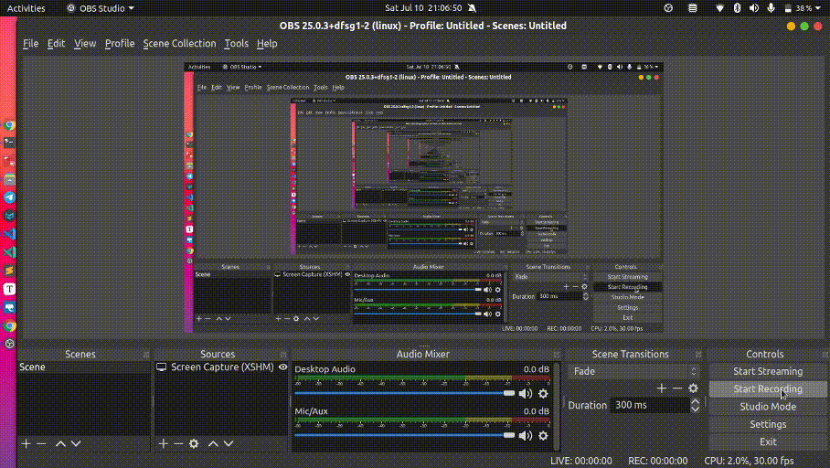
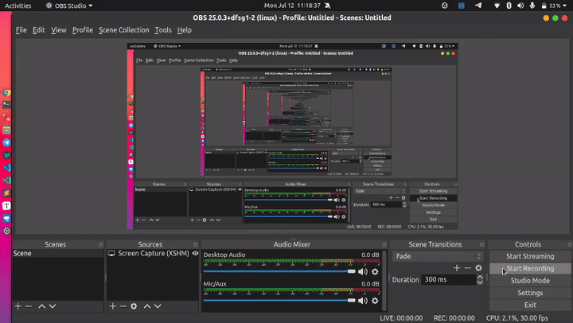

# Administration Task

## Creating New User

### **Options**

* **General**
  * Name : username
  * Comment : description
* **Definition**
  * Password : user password
  * Account Expires
  * Connection Limit : number of connections that user can have to DB, default -1
* **Privileges**
  * Update Catalog : // TODO
  * Inherits rights from parent : includes pg\_stats, pg\_monitor etc ..
  * streaming replication and backup : // TODO

## Query Editor

### Load Data using pgAdmin4

