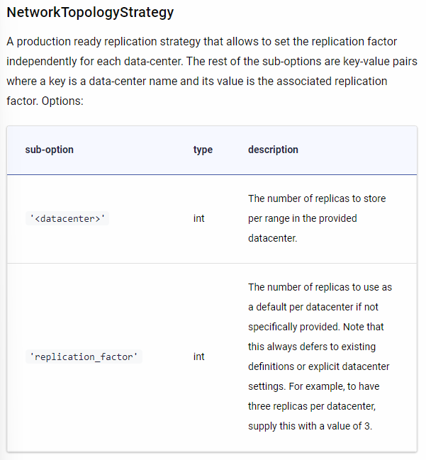

# Data Types

## Boolean Data

* TRUE
* FALSE
* NULL

| TRUE | FALSE |
| :--- | :--- |
| TRUE | FALSE |
| 'true' | 'false' |
| 't' | 'f' |
| 'yes' | 'no' |
| 'y' | 'n' |
| '1' | '0' |

```sql
CREATE TABLE booltable (
    id SERIAL PRIMARY KEY ,
    is_enable BOOLEAN NOT NULL
);

INSERT INTO booltable (is_enable) VALUES (TRUE), ('true'), 
    ('y') , ('yes'), ('t'), ('1');
INSERT INTO booltable (is_enable) VALUES (FALSE), ('false'), 
    ('n') , ('no'), ('f'), ('0');
    
select * from booltable;

SELECT * FROM booltable WHERE is_enable = 'y';

SELECT * FROM booltable WHERE NOT is_enable;
```

## Character Data

| Character Type | Notes |
| :--- | :--- |
| CHARACTER \(N\), CHAR \(N\) | fixed-length, blank padded |
| CHARACTER VARYING \(N\), VARCHAR\(N\) | variable length with length limit |
| TEXT, VARCHAR | variable unlimited length, max 1GB |

* n is default to 1

```sql
select CAST('Uday' as character(10)) as "name";

-- output
"Uday      "

select 'Uday'::character(10) as "name";

-- output
"Uday      "

-- varchar
select 'uday'::varchar(10);
"uday"

-- text
select 'lorem ipsum'::text;
"lorem ipsum"
```

## Numeric Data

| Types | Notes |
| :--- | :--- |
| Integers | whole number, +ve and -ve |
| Fixed-point, floating point | for fractions of whole nu |

| type | size \(bytes\) | min | max |
| :--- | :--- | :--- | :--- |
| smallint | 2 | -32678 | 32767 |
| integer | 4 | -2,147,483,648 | 2,147,483,647 |
| bigint | 8 | -9223372036854775808 | 9223372036854775807 |

| type | size | range |
| :--- | :--- | :--- |
| smallserial | 2 | 1 to 32767 |
| serial | 4 | 1 to 2147483647 |
| bigserial | 8 | 1 to 9223372036854775807 |

## Fixed Point Data

**numeric \( precision , scale \) \| decimal \( precision , scale \)**

* precision : max number of digits to the left and right of the decimal point
* scale : number of digits allowable on the right of the decimal point

## Floating Point Data

| Type | Notes |
| :--- | :--- |
| Real | allows precision to six decimal digits |
| Double precision | allows precision to 15 digits points of precision |

| type | size | storage type | Range |
| :--- | :--- | :--- | :--- |
| numeric, decimal | variable | fixed point | 131072 digits before decimal point and 16383 digits after the decimal point |
| real | 4 | floating point | 6 decimal digits precision |
|  double precision | 8  | floating point | 15 decimal digits precision |




          **Hierarchical order to select best type : numeric &gt; decimal &gt; float**

## Date Time Data

| type | stores | size | low | high |
| :--- | :--- | :--- | :--- | :--- |
| Date | date only | 4 | 4713 BC | 294276 AD |
| Time | time only |  | 4713 BC | 5874897 AD |
| Timestamp | date and time |  | 4713 BC | 294276 AD |
| `Timestampz` | date, time and timezone |  | 4713 BC | 294276 AD |
| Interval | difference btw time |  |  |  |

### Date type

```sql
create table table_dates (
	id serial primary key,
	employee_name varchar(100) not null,
	hire_date DATE NOT NULL,
	add_date DATE DEFAULT CURRENT_DATE
);

INSERT INTO table_dates (employee_name, hire_date)
    values ('uday','2020-02-02'),('another uday','2020-02-01');

select *
from table_dates;

select NOW();
```

### Time type


```sql

create table table_time (
    id serial primary key ,
    class_name varchar(10) not null ,
    start_time time not null ,
    end_time time not null
);

insert into table_time (class_name, start_time, end_time) 
    VALUES ('maths','08:00:00','08:55:00'),
           ('chemistry','08:55:00','09:00:00');

select * from table_time;

select CURRENT_TIME;

select CURRENT_TIME(2);

select LOCALTIME;

select time '12:10' - time '04:30' as RESULT;

-- format : interval 'n type'
-- n = number
-- type : second, minute, hours, day, month, year ....

select CURRENT_TIME ,
    CURRENT_TIME + INTERVAL '2 hours' as RESULT;
select CURRENT_TIME ,
    CURRENT_TIME + INTERVAL '-2 hours' as RESULT;    
```

### Timestamp and Timezone

* `timestamp` : stores time without time zone
* `timestamptz` : timestamp with time zone , stored using UTC format
* adding timestamp to timestamptz without mentioning the zone will result in server automatically assumes timezone to system's timezone
* **Internally, PostgreSQL will store the timezone accurately but then outputting the data, will it be converted according to your timezone**

```sql
SELECT name FROM pg_timezone_names 
    where name = 'posix/Asia/Calcutta';

SET TIMEZONE='Asia/Calcutta';

SELECT NOW()::TIMESTAMP;

create table table_time_tz (
    ts timestamp,
    tstz timestamptz
);

INSERT INTO table_time_tz (ts, tstz) 
    VALUES ('2020-12-22 10:10:10',
            '2020-12-22 10:10:10.009+05:30');

SELECT * FROM table_time_tz;

SELECT CURRENT_TIMESTAMP;

SELECT timezone('Asia/Singapore','2020-01-01 00:00:00')
```

## UUID

* UUID : Universal Unique Identifier
* PostgreSQL doesn't provide internal function to generate UUID's, use `uuid-ossp`

```sql
create extension if not exists "uuid-ossp";

select uuid_generate_v1();

-- pure randomness
select uuid_generate_v4();

create table products_uuid (
    id uuid default uuid_generate_v1(),
    product_name varchar(100) not null
);

insert into products_uuid (product_name) 
    values ('ice cream'),('cake'),('candies');

select * from products_uuid;

create table products_uuid_v4 (
    id uuid default uuid_generate_v4(),
    product_name varchar(100) not null
);

insert into products_uuid_v4 (product_name) 
    values ('ice cream'),('cake'),('candies');

select * from products_uuid_v4;
```

