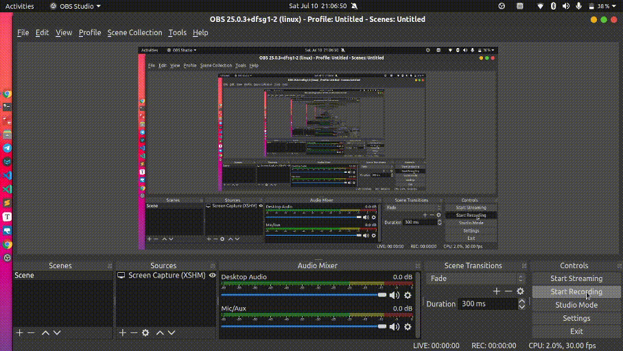
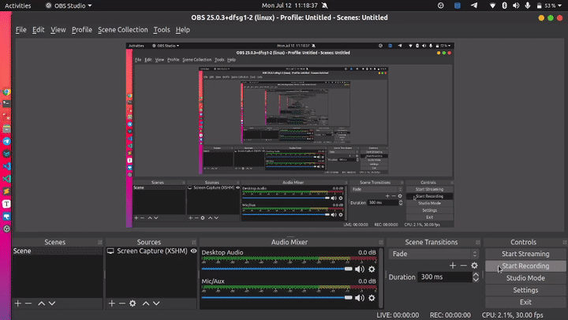

# PgAdmin Tool

## Creating New User

### **Options**

* **General**
  * Name : username
  * Comment : description
* **Definition**
  * Password : user password
  * Account Expires
  * Connection Limit : number of connections that user can have to DB, default -1

**Refer to documentation for more details**

- https://www.pgadmin.org/docs/pgadmin4/development/role_dialog.html

## Query Editor

## Load Data using pgAdmin4

